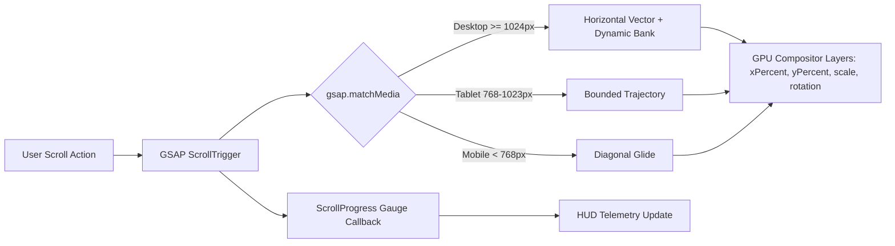

# Scroll Driven Hero Animation — ITZ FIZZ

[](https://vitejs.dev/)
[](https://reactjs.org/)
[](https://greensock.com/gsap/)
[](https://tailwindcss.com/)
[](https://opensource.org/licenses/MIT)

A high-precision, production-grade scroll-driven hero motion showcase built with **React**, **GSAP ScrollTrigger**, and **Tailwind CSS**. Developed for a frontend engineering internship submission.

---

## 🌟 Overview

This project presents an automotive motion landing page featuring a scroll-bound kinetic hypercar animation. The experience marries micro-interactions with hardware-accelerated timeline scrubbing, responsive multi-breakpoint geometry, and telemetry visualizations.

### Live Demo Concept
- **Reference Inspiration:** [Scroll Car Animation](https://paraschaturvedi.github.io/car-scroll-animation)
- **Key Upgrade:** Original visual design, multi-stage scroll scrub physics, responsive breakpoints using `gsap.matchMedia()`, dynamic HUD overlays, and `prefers-reduced-motion` compliance.

---

## ✨ Features

- 🏎️ **Scroll-Driven Hero Motion:** Deterministic multi-axis translations, scale curves, and rotation matrices synchronized 1:1 with user scroll progress.
- 📌 **Pinned Stage Architecture:** Hero container pins smoothly during the motion sequence across custom viewport heights without jumps or reflow glitches.
- ⚡ **GSAP Staggered Intro Sequence:** Initial page load timeline animating typography (character blur reveal), pill badges, vehicle entrance, and key statistics.
- 📊 **Sequential Statistics Counter:** 4 key performance metrics animated with refined easing (`power2.out` / `back.out`).
- 📱 **Fully Responsive (`gsap.matchMedia`):**
  - **Desktop (≥ 1024px):** Full horizontal trajectory, wide kinetic light trails, high-speed banking, and side-exiting transition.
  - **Tablet (768px – 1023px):** Constrained bounding-box traversal with adjusted scale and rotation.
  - **Mobile (< 768px):** Diagonal vertical-forward sweep that eliminates horizontal scrollbars and prevents text occlusion.
- 📈 **Dynamic Scroll Progress Gauge:** Minimalist floating progress bar and percentage gauge updating via ScrollTrigger callbacks.
- 🛠️ **Interactive Telemetry HUD (Section 3):** Real-time downforce simulator, drive profile toggle (Track / Stealth / Kinetic Overboost), and velocity slider.
- ♿ **Accessibility & Reduced Motion:** Respects `prefers-reduced-motion: reduce` by replacing intensive transforms with clean fade states.
- 🚀 **Zero Layout Thrashing:** 100% of continuous animations run on GPU compositor layers (`transform3d`, `opacity`, `filter`).

---

## 🛠️ Tech Stack

| Technology | Purpose |
| :--- | :--- |
| **React 18** | Modular component architecture & state orchestration |
| **Vite 6** | Sub-millisecond HMR & optimized production bundling |
| **GSAP 3.12** | Core tween engine & multi-step timeline scheduling |
| **GSAP ScrollTrigger** | Pinning, scroll progress sampling & scrub physics |
| **Tailwind CSS 3** | Dark design tokens, glowing utilities & responsive styles |
| **Lucide React** | Lightweight icons |

---

## 📐 Animation Architecture

The core animation logic is isolated in [`src/animations/heroAnimations.js`](./src/animations/heroAnimations.js) to decouple animation calculations from presentation components.



### Motion Phases (Desktop Timeline):
1. **0.00 – 0.35 (Acceleration):** Headline subtle parallax upward fade, car accelerates along starting runway vector, kinetic light trail expands.
2. **0.35 – 0.70 (High-Speed Drift):** Car traverses center stage with slight banking angle, underglow blooms, telemetry lock engages.
3. **0.70 – 1.00 (Transition Exit):** Car accelerates toward the edge, trail reaches peak luminosity, smoothly guiding the eye into the "Built For Motion" section.
4. **Bi-directional Scrub:** Scrolling up reverses the timeline in exact frame-accurate synchrony.

---

## 📂 Project Structure

```
├── .github/workflows/
│   └── deploy.yml          # GitHub Pages automated deployment
├── src/
│   ├── animations/
│   │   └── heroAnimations.js # GSAP Intro & ScrollTrigger logic
│   ├── assets/
│   │   └── hypercar.jpg    # Custom aerodynamic electric hypercar
│   ├── components/
│   │   ├── Navbar.jsx      # Frosted glass navigation with live status
│   │   ├── Hero.jsx        # Pinned hero section & kinetic stage
│   │   ├── Stats.jsx       # 4 metric cards with staggered entry
│   │   ├── ScrollProgress.jsx # Minimalist scroll progress gauge
│   │   ├── FeatureSection.jsx # 3 feature cards & architecture specs
│   │   ├── TelemetrySection.jsx # Interactive drive modes & aero HUD
│   │   ├── CTASection.jsx  # Replay trigger & repo clone snippet
│   │   └── Footer.jsx      # Minimal footer with back-to-top
│   ├── data/
│   │   ├── stats.js        # Metric statistics data
│   │   ├── features.js     # Motion capabilities & features
│   │   └── telemetry.js    # Drive modes & hardware specs
│   ├── App.jsx             # Main application orchestrator
│   ├── index.css           # Custom scrollbar, glows & Tailwind setup
│   └── main.jsx            # React root mount
├── index.html              # HTML5 container & Google Fonts
├── vite.config.js          # Base path configuration for GitHub Pages
└── tailwind.config.js      # Custom theme, fonts & color tokens
```

---

## 💻 Local Setup & Development

### 1. Prerequisites
- Node.js version 18+ or 20+
- npm version 9+

### 2. Clone the Repository
```bash
git clone https://github.com/your-username/scroll-driven-hero-animation.git
cd scroll-driven-hero-animation
```

### 3. Install Dependencies
```bash
npm install
```

### 4. Start Development Server
```bash
npm run dev
```
Open [http://localhost:5173](http://localhost:5173) in your browser.

---

## 📦 Production Build

To compile an optimized static bundle:

```bash
npm run build
```

The production assets will be output to the `dist/` directory.

To preview the production build locally:
```bash
npm run preview
```

---

## 🚀 GitHub Pages Deployment

This repository includes a pre-configured GitHub Actions workflow in `.github/workflows/deploy.yml` and a relative base path in `vite.config.js` (`base: './'`).

### Enabling Deployment:
1. Push your repository to GitHub.
2. In your repository settings, navigate to **Settings** > **Pages**.
3. Under **Build and deployment** > **Source**, select **GitHub Actions**.
4. Every push to `main` will automatically build and deploy the project to GitHub Pages.

---

## 📜 Credits & Attribution

- **Reference concept:** [Scroll Car Animation](https://paraschaturvedi.github.io/car-scroll-animation) by Paras Chaturvedi.
- **Typography:** [Space Grotesk](https://fonts.google.com/specimen/Space+Grotesk), [Orbitron](https://fonts.google.com/specimen/Orbitron), and [JetBrains Mono](https://fonts.google.com/specimen/JetBrains+Mono) via Google Fonts (Open Font License).
- **Icons:** [Lucide Icons](https://lucide.dev/) (ISC License).
- **Visual Assets:** Custom aerodynamic electric hypercar render designed specifically for this assignment.

---

## 📄 License

This project is licensed under the [MIT License](LICENSE).
